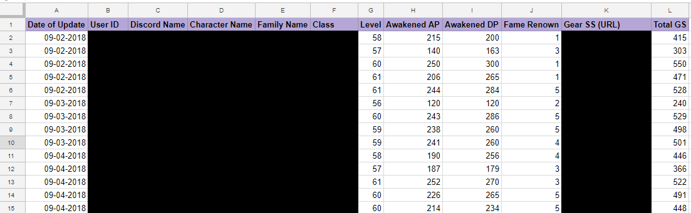

# bot
## Demonstration of my bot for a game to store statistics of each member. This makes it more convenient for the officers to track progression and payouts.

### For regular guild members

### For officers of a guild

- Keeping track of event (nodewar) attendance is crucial for the officers to calculate weekly payouts as a member of a guild. 
- The bot only allows the user to click reaction or the other.
- The bot stores the list of users attending/not attending into a spreadsheet (not depicted).

Later: will be able to calculate how many times a member shows up to make it more convenient for guild officers.
