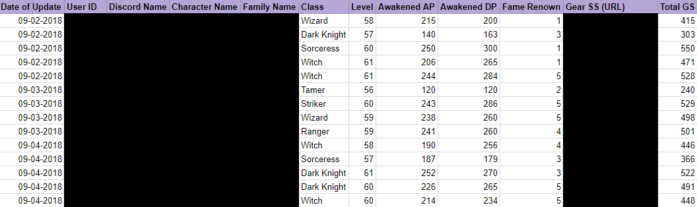

# bot
## Demonstration of my bot for a game to store statistics of each member. This makes it more convenient for the officers to track progression and payouts.

The game does not have this information stored in a neat, accessible way. Competitive guilds require their members to update their gear statistcs monthly to check improvements.

Prior to the bot: Using Google Forms and requiring every member to fill out the form

### For regular guild members

Members to fill out their monthly form by using commend !form...

This is how part of the process looks like filling out the form (bot asks you a question, you type your answer!)

After filling out form, their stats gets uploaded to a spreadsheet. Blurred out for privacy.

Now: Avoids tedious method of Google Forms. More appealing and interactive monthly member forms.

### For guild officers

Guilds usually participate in up to 5 "events" (nodewars) a week. It is important to keep an attendence roll of who is present or not on the day of the event because it is crucial for the officers to calculate weekly payouts for members of a guild. 

Prior to the bot: Attendence was recorded by manually checking and updating the name of each person that was there onto a sheet.

To create an event

Members can now react with an emoji (the checkmark or the X) to let the officers know if they are attending the war event.

- The bot only allows the user to click only one reaction.
- The bot stores the list of users attending/not attending into a spreadsheet (not depicted).

Now: More conveniently, only one person needs to confirm members who actually attend the event.

Later: will be able to calculate how many times a member shows up to make it more convenient for guild officers.
